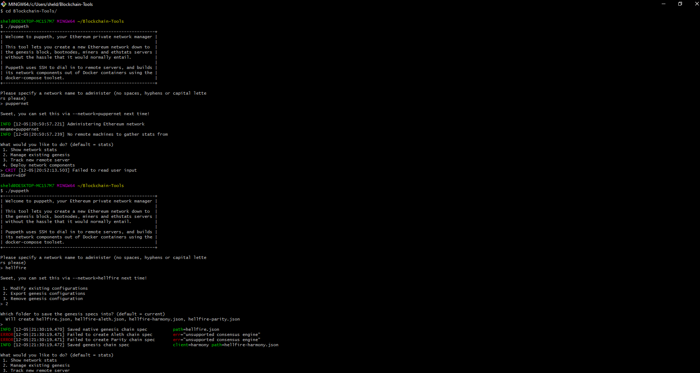
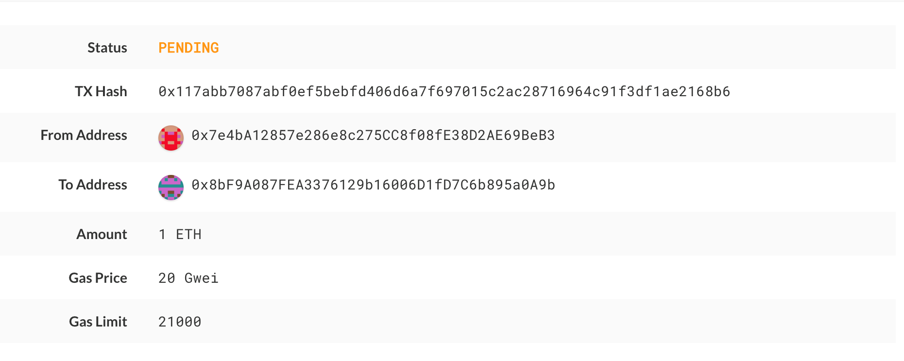

# Proof of Authority Development BlockChain

**Requierments**
* [My Crypto](https://download.mycrypto.com), a cryptocurrency "wallet" we will be using
* [Geth](https://geth.ethereum.org/downloads/), the heart of blockchain. 
    * Select the ``Geth & Tools version 1.9.7``
* Create a folder and store the ``Geth & Tools`` (in this example we will name it ``"Blockchain"``)
---

**Create two nodes with accounts**

* Launch a user-interface, and navigate to the Blockchain folder
* Create the first node using the geth command, and passing it a new account data directory
    * **``./geth account new --datadir YOUR_NODE_NAME``**(for this example we will name it node1)
* Store the node's key, and secret key file for later
* Repeat the same proccess for the second node
    * **``./geth account new --datadir YOUR_NODE_NAME``**(for this example we will name it node2)
    
**Generate a Network**
* Inside the "Blockchain" folder run the following command
    * **``./puppeth``**
* Once executed you will be prompeted to name your network (remember there should be no spaces, hyphens or capital letters)
    * Create your own name, for this example we will use "puppernet"
* In the next prompt select number 2, "Configure new gensis"
* Create a "Clique - proof-of-authority" by selecting the number 2 option
    * Continue to with the defult option's by pressing "enter" until you are prompted to seal accounts
* Paste both stored keys generated from the node accounts created above to be allowed to seal
    * DO NOT INCLUDE THE ``0x``
    * When finished press "enter" when promted with an empty "0x"
* Pre-fund the accounts by pasting them into the next promt
    * Advisable both, optional one
* Choose no for pre-funding the pre-compiled accounts with ``wei``, to keep the genesis cleaner
* Complete the prompts, once back at the main menu choose the "Manage existing genesis" by selecting number 2
* Export the genesis configurations by selecting number 2
    * Press "enter" to store the files in the current directory
    * This will fail to create two of the files, but you only need **``networkname.json``**
    
**Synchronize Node's**
* Initialize the both node's
    * **``./geth init yournetworkname.json --datadir node1``**
    * **``./geth init yournetworkname.json --datadir node2``**
* Run the first node
    * **``./geth --unlock ACCOUNT_KEY --mine``**
    * Above the unlocking of the account you will find **``Started P2P networking``**, copy and store the **``encode``** results 
* Run the second node unlock the account, enable the mining, and the RPC flag. 
   
   **Windows**
    * **``./geth --rpc --bootnodes "enode://<replace with node1 enode address>"``** --ipcdisable 
   
  **OS X**
    * **``./geth --rpc --bootnodes "enode://<replace with node1 enode address>"``**
    
### ***You should see both nodes producing new blocks at this point, CONGRATS!***   

**Custome Node**
* Open "MyCrypto", and chance the network (bottom left side)
* Click "Add Custom Node"
    * In "Network" scroll down to "Custom"
    * Set the "Currency" to "ETH"
    * Use the information set in gensis to complet the other sections
    * In the URL paste **``http://127.0.0.1:8545``**
* Make sure you are connected to your custome node
* On the left panel menu select "View & Send"
* Select "Pricate Key"
* Copy and store the pricate key of the pre-funded walled and click "Unlock"
* Verify that the account was pre-funded

**Transactions**
* Copy the pre-funded address into the "To Address" section
* Enter the amount of ETH
* Send the transaction by selecting the "Send Transaction" button 
* Click the "Check TX Status" when the message pops up
* Verify the transaction in the "Pending" section 

# SCREENSHOTS

***Puppeth***

***Transaction***
